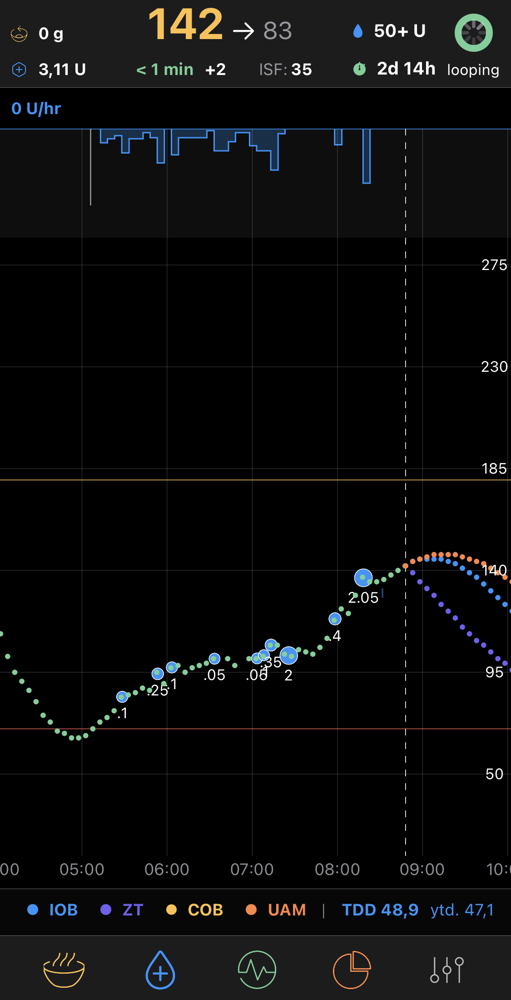
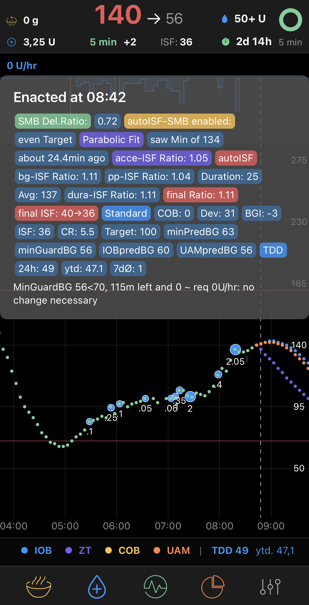
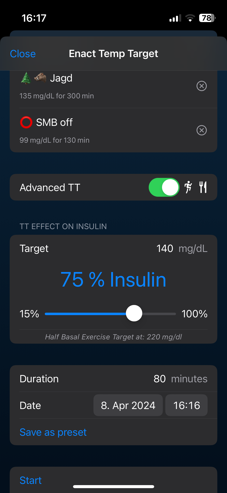
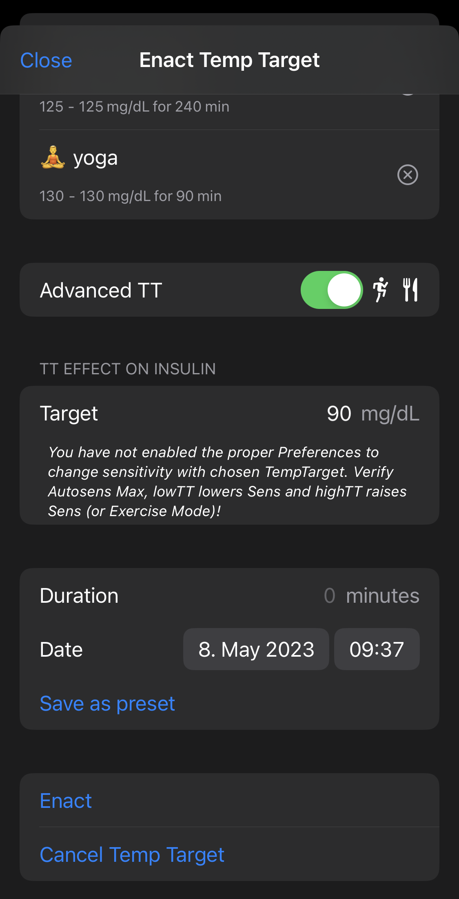
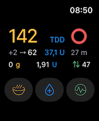
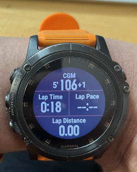

# iAPS with autoISF

## Introduction

iAPS - an artificial pancreas system for iOS based on [OpenAPS Reference](https://github.com/openaps/oref0) algorithms (Master 0.7.1) and Ivan Valkous stale Swift repo, freeaps.git.

Thousands of commits later, with many new and unique features added, the iOS app has been renamed to iAPS under a new organisation, Artificial Pancreas. iAPS uses lot of frameworks published by the Loop community.

# autoISF
The autoISF branch is based on dev from the original [iAPS repo](https://github.com/artificial-pancreas/iaps) and includes my implementation of [autoISF by ga-zelle](https://github.com/T-o-b-i-a-s/AndroidAPS) for AAPS and some other extra features. autoISF is off by default.

autoISF adjusts ISF depending on 4 different effects in glucose behaviour that autoISF checks and reacts to:
* acce_ISF is a factor derived from acceleration of glucose levels
* bg_ISF is a factor derived from the deviation of glucose from target
* delta_ISF and pp_ISF are factors derived from glucose rise, 5min, 10min and 45min deltas and postprandial time frames
* dura_ISF is a factor derived from glucose being stuck at high levels

## AIMI B30
Another new feature is an enhanced EatingSoon TT on steroids. It is derived from AAPS AIMI branch and is called B30 (as in basal 30 minutes).
B30 enables an increased basal rate after an EatingSoon TT and a manual bolus. The theory is to saturate the infusion site slowly & consistently with insulin to increase insulin absorption for SMB's following a meal with no carb counting. This of course makes no sense for users striving to go Full Closed Loop (FCL) with autoISF. But for those of you like me, who cannot use Lyumjev or FIASP this is a feature that might speed up your normal insulin and help you to not care about carb counting, using some pre-meal insulin and let autoISF handle the rest.

To use it, it needs 2 conditions besides setting all preferences:
* Setting a TT with a specific adjustable target level.
* A bolus above a specified level, which results in a drastically increased Temp Basal Rate for a short time. If one cancels the TT, also the TBR will cease.

## Exercise Modes & Advanced TT's
Exercise Mode with high/low TT can be combined with autoISF. The ratio from the TT, calculated with the Half Basal Exercise target, will be adjusted with the strongest (>1) or weakest (<1) ISF-Ratio from autoISF. This can be substantial. I myself prefer to disable autoISF adjustments while exercising, relying on the TT Ratio, by setting `Exercise toggles all autoISF adjustments off` to on.
There was some discussion how to implement the excercise targets with configurable half basal exercise target variable and a specific desired insulin ratio in iAPS. This requires highTTraisesSens and lowTTlowersSens setting. In this implementation, which is a little different than in iAPS, you first define at which TT level you want to be. Frome this the available insulin percentages are derived:
* with a TT above 100mg/dL you can only have a insulin percentage below 100% (more sensitive to insulin while exercising)
* If you don't have the setting exercise mode or highTTraisesSens enabled, you will not be able to specify an insulin percentage below 100% with a high TT.
* with a TT below 100 mg/dL you can have an Insulin ratio above 100% (less sensitive to insulin) but less than what your autosens_max setting defines. E.g. if you have autosens_max = 2, that means your increased insulin percentage can be max. 200%.
* If you have lowTTlowersSens disabled or you have autosens_max=1, you cannot specify a percentage >100% for low TTs.

If you do have the appropriate settings, you can chose an insulin ratio with the slider for the TT you have set and the half basal exercise target will be calculated and set in background for the time the TT is active.

## Screen Shots

on iPhone 13 mini:

Watches:

# Install
For multiple alternative installation methods refer to to the parent repository and its [ReadMe File](https://github.com/Artificial-Pancreas/iAPS/tree/dev#readme). This branch does not deviate from it.

### Please understand that iAPS and especially autoISF is:
- highly experimental and evolving rapidly.
- not CE approved for therapy.

# Changes

Latest version of original iAPS is maintained by Jon and the gang. It brings significant improvements for Omnipod Dash pumps and Dexcom G6 and G7sensors, Statistics, Automations with Shortcuts, Garmin watch and such a lot of cool things that make you go Uuh. Looping should be immediate and robust.

[iAPS repo github](https://github.com/artificial-pancreas/iaps.git)

## autoISF Version
Refers to the changes done to the original oref0 used in FAX, the source can be found at my [oref0-repository](https://github.com/mountrcg/oref0/tree/dev_aisf_TDD)

* 2.2.8.3
	* AIMI B30 feature
	* dev release with current mods as of Mar 23, 2023
	* documentation at https://github.com/ga-zelle/autoISF

## Release
Refers to iAPS, which is currently mainly improved by Jon & Pierre at this [github repository](https://github.com/Artificial-Pancreas/iAPS).
I had to disable Overrides/Profiles from the original iAPS, as Jon does not publish the necessary oref code - you would have to use the original if you need it.
Also note that you can achieve almost everything that Profiles do with the Advanced TempTarget and thenecessary settings in preferences.  However, Profiles are a cool feature and easier to handle, just not here in this branch.

* 2.2.1
	* Bolus Calculator based on EventualBG
	* and many more refer to [original release notes]( https://github.com/Artificial-Pancreas/iAPS/releases/tag/v2.2.1)
* 2.0.1
	* many localizations and crowdin re-ntegration
	* Overrides/Profile adaptions in iAPS, disabled in autoISF branch as oref Code not published to incorporate with autoISF
* 1.6.0
	* Garmin watch
	* Automation
	* new Statistics page
* 1.2.1
	* Loop Framework 3.2
	* TempTarget changes for Slider & Rounding
* 1.1.1
	* ExerciseMode calculation with InsulinRatio Slider
	* Tag changes in Popup
	* display ratio from TempTargets in InfoPanel
* 1.1.0
	* Meal presets
	* oref fixes
	* G7 smoothing
* 1.09
	* Allow to delete Carbs when connexion with NS is impossible - Alert the user of the issue. (#606), Pierre Avous.
	* Put back DASH strings deleted in Loop3 branch
	* Reverts oref0 commit. Scott Leibrand. Revert "fix(lib/iob): Move value checks up to index.js". Fix for too high predictions.
	* Synchronise upload readings toggle in dexcom settings with FAX settings (#608), Pierre Avous.
	* LibreView
* 1.08
	* Fat Protein conversions
	* AppleHealth Integration, good for manual BG values
	* fixes MDT and G6
* 1.07
	* Dash & G7 frameworks from Loop3
	* CoreData refactoring

## Remarks
Due to the heavy refactoring and my changes to Jon's CoreData, when moving from a version (below 1.07) to (1.07 or above) it is advised to delete FAX and install with a new clone. All current stats will be gone and build up again. All settings will be at default values, like `maxIOB = 0`. Due to deleting FAX you should do it in between pods, as you loose this information. Now with iAPS starting v1.6 and autoISF 2.2.8.3 also all settings will revert to standard.

# Documentation

For all the relevant notes for iAPS please refer to to the parent repository and its [ReadMe File](https://github.com/Artificial-Pancreas/iAPS/tree/dev#readme).

Most of the changes for autoISF are made in oref code of OpenAPS, which is minimized in iAPS. So it is not really readable in Xcode, therefore refer to my [oref0-repository](https://github.com/mountrcg/oref0/tree/dev_aisf_TDD).

[Documentation of autoISF implementation for AAPS](https://github.com/ga-zelle/autoISF) is applicable for iAPS as Algorithm is 100% identical

[AAPS autoISF Branch](https://github.com/T-o-b-i-a-s/AndroidAPS)

